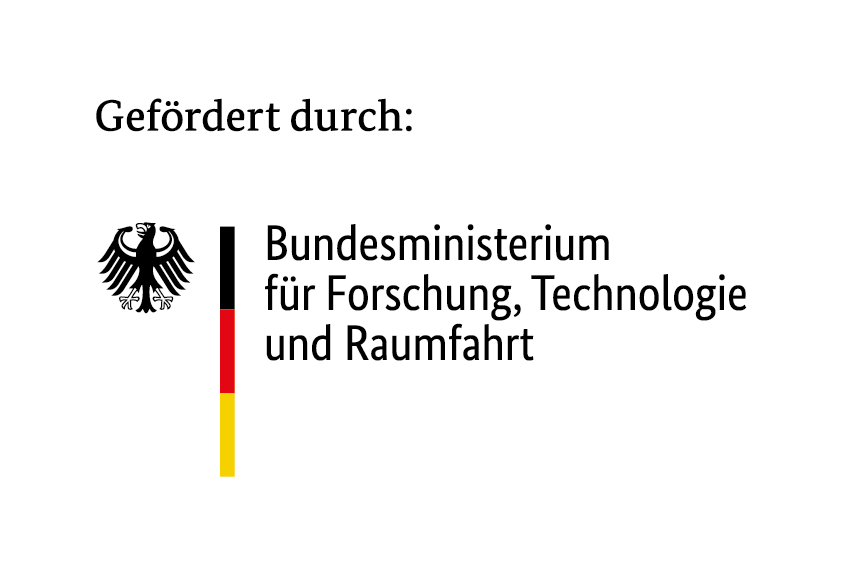

<div style="background-color: #ffffff; color: #000000; padding: 10px;">

<h1> KISZ Getting Started
</div>

This repository provides getting started materials and examples for the AI Service Center Berlin Brandenburg (KISZ). It includes workshops, tutorials, and practical examples to help you get started with AI services and tools.

## Features

- **Workshop Materials**: Comprehensive Jupyter notebooks for hands-on learning
- **Docker Setup**: Ready-to-use containerized environment for consistent development
- **Templates**: Reusable templates for your own AI projects
- **Documentation**: Clear guides and examples for common AI workflows

## Setup and Installation

### Prerequisites

- Docker and Docker Compose
- NVIDIA GPU with CUDA support (optional, but recommended for faster performance)

### Quick Start

1. Clone the repository:
   ```bash
   git clone https://github.com/aihpi/kisz-getting-started.git
   cd kisz-getting-started
   ```

2. Run the setup or install dependencies:
   ```bash
   chmod +x setup.sh
   ./setup.sh
   ```

3. Access the application:
   - Frontend: http://localhost:8080
   - Backend API: http://localhost:8000

## User Guide

### Using the Workshops
1. Navigate to the `03_workshop` directory for Jupyter notebook tutorials
2. Use the Docker environment for a consistent setup across different systems
3. Follow the numbered notebooks in order for the best learning experience

### Recommendations
- Start with the overview notebook (`00_overview.ipynb`) to understand the structure
- Use a GPU-enabled environment for better performance with AI models
- Customize the templates for your own projects

## Limitations

- **GPU Dependency**: Some advanced examples require NVIDIA GPU support
- **Resource Requirements**: Large language models may require significant computational resources


## References

- [AI Service Center Berlin Brandenburg](https://hpi.de/kisz)
- [Hasso Plattner Institute](https://hpi.de)

## Author
- AI Service Center Berlin Brandenburg

## License

This project is licensed under the MIT License - see the LICENSE file for details.


---

## Acknowledgements


The [AI Service Centre Berlin Brandenburg](http://hpi.de/kisz) is funded by the [Federal Ministry of Research, Technology and Space](https://www.bmbf.de/) under the funding code 01IS22092.
